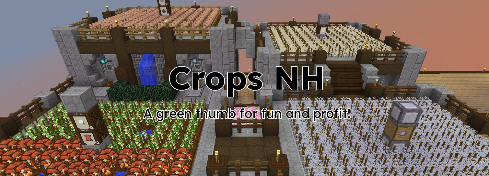
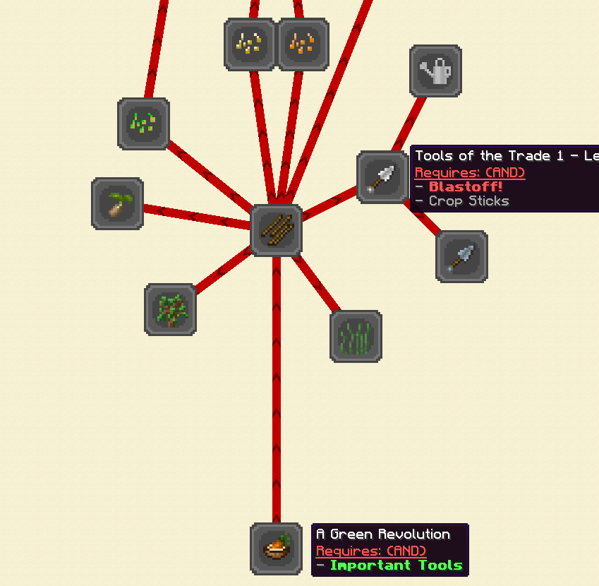
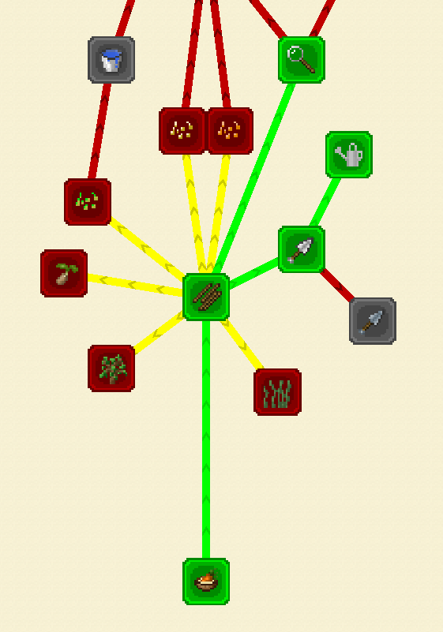
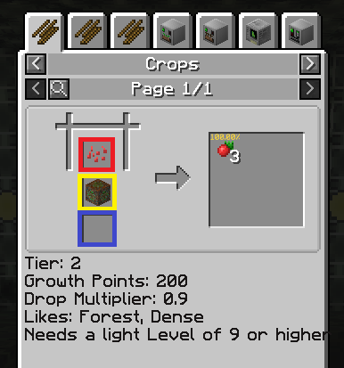
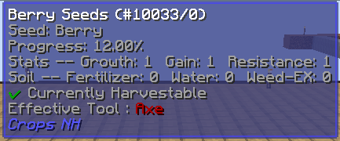
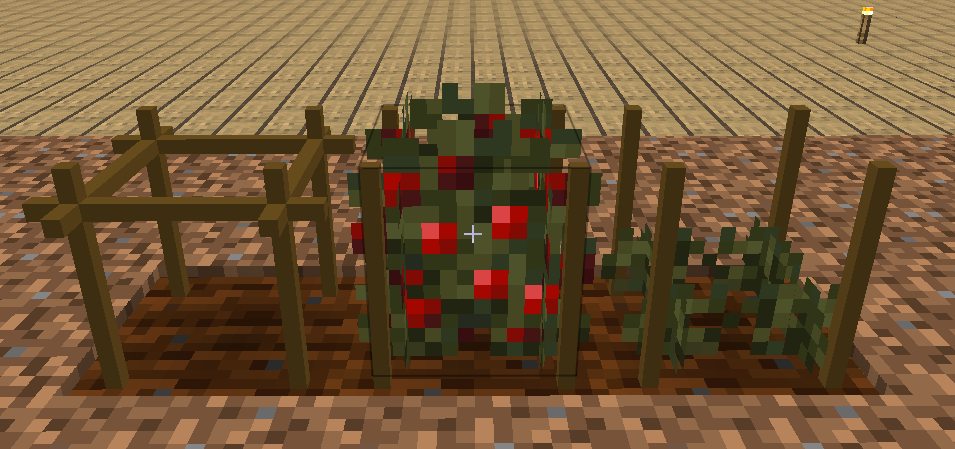

# Beginner's Guide To CropsNH

Welcome to CropsNH!  This mod is one of the standout additions to the pack in 2.9 and this series of guides will tell you everything you need to know to become a crop master!

In this first guide in the series we'll be covering all you need to know to get started up to and including getting your very first 31/31/31 seed.  Subsequent guides will cover topics such as pool breeding, deterministic breeding, machine breeding, downstatting, and much more!

## Gearing up for some serious farming

While you can get started on CropsNH as early as the Stone Age right after the "Important Tools" quest, I would suggest waiting until you have ~20 Steel to spare and the "Blastoff!" quest in the Steam Age to get started.

### A Green Revolution

Quest progress is very important!  The quest rewards and loot bag drops you can get are very desirable, so to begin with head on over to the "The Green Revolution" quest tab and get started with the "A Green Revolution" quest.  In addition to what the quest wants you to obtain I've prepared an extended shopping list for you.

- A 9x9 plot of land in an 80% humidity biome
- 64x (Any) Log
- 8x (A Sapling
- 8x Berry
- 5x Seeds
- 5x Carrot
- 5x Potato

Once your shopping is done, complete the quest (the choice reward here doesn't matter much, we'll be breeding max statted versions of both soon enough!) and open the lootbag. 

### Crop Sticks

Now with that out of the way, let's get down to doing some crafting!  With that wood I had you collect you should be able to craft 128 Crop Sticks using the Shaped Crafting recipes, don't worry they'll get cheaper later!  Snag the Fertilizer as a reward and push on!

### Crafting your tools

Next we'll knock out three quests at once.  Unless you got lucky enough to get one of these tools to drop from your first lootbag grab the items from this second shopping list and use them to craft craft 1x Spade, 1x Watering Can (Empty), and 1x Plant Lens.

- 20 Steel Ingot
- 11 Iron Ingot
- 6 Flint
- 2 (Any) Log
- 1 Glass
- 1 Diamond

Don't forget to right click some water with the Watering Can (Empty) to fill it up!  You'll want to take the 32 Fertilizer and LootBag (Crops) for your choice rewards.  Open the bag right away!

## Reading for Nerds

One final step before we get to farming!  Unlike its predecessor IC2 Crops, the information about CropsNH in NEI is super useful!  Go ahead and check the uses on the Berry Seeds.

### Crops Tab

The Crops tab gives us basic information on how to grow the crop.  On the left you'll see the seed with one or two blocks displayed under it, on the right the items the crop has the potential to drop when harvested, and below some numbers for nerds.

The first block listed on the left is the "soil" block, or the block the Crop Stick must be placed on for it to accept that seed.  If you try to place a seed on a Crop Stick that's on the wrong soil you will receive a message stating "This crop needs a different soil (check usages in NEI)".

The second block listed on the left is the "base" block (not all seeds require a base block!).  When a seed has a base block listed that means that this block MUST appear directly under the soil block for the crop to grow or result from a breeding attempt.

The numbers for nerds shouldn't be ignored!  They mean the following things:

- Tier - This tells you how complex the crop is.  The higher the number the more requirements you are likely to need to meet to be able to breed and grow the crop.  We'll be sticking to Tiers 1 and 2 for now.
- Growth Points - The higher this number the slower the crop will grow under ideal conditions.  The fastest growing crop is Torchberries (150), followed closely by those Berrys (200) I had you get earlier.
- Drop Multiplier - The number by which drops are multiplied???  Needs research
- Likes - This lists the biome tags that the specific crop likes.  We'll get more into how to keep your plants happy later.  For now this can mostly be ignored, but if you're curious you can head over to The GTNH Wiki [https://wiki.gtnewhorizons.com/wiki/Biome] for a comprehensive list of biome tags.
- Other notes will appear below 

### Crop Breeding Tab

This tab gives you information on how to deterministically breed the seed in question.  We'll delve deeper into this later, but for now just take note of the two blocks under the seed in the center.  They serve the same function as the blocks listed on the Crops tab.

### Crop Mutation Pools Tab

Similar to the Crop Breeding tab, this tab gives you information on how to randomly breed the seed in question.  Note that when doing pool breeding the correct soil and base blocks are still required even thought they aren't listed here!  Again we'll delve deeper into this once we've got our first max stat crop.

### Crop Tool Tip

Once you're comfortable with those three tabs in NEI go ahead and till a block of dirt (right click it with your Spade) near a water source to create farmland.   Slap down a single crop stick and then right click one of your Berrys into it.  Finally right click the Crop Stick Berry combination with your Plant Lens.

Notice that the tooltip has been updated with all sorts of useful information!

While the Stats are important and control various aspects of the crop growing and breeding process all you really need to know is that 31 is the best, you want it for all three stats, and you NEVER want Growth or Gain to be higher than Resistance.  For more information on what the stats actually do, see the "Crop Stats" quest.

The Soil information simply tells you how much Fertilizer, Water, and Weed-Ex is applied to that particular crop.

## Enough Yapping, Let's Get Farming!

Once the Berry crop you planted has reached Progress: 100.00% (check the tooltip!) you will want to place down a crosscrop next to it.  Make sure to till the soil (it won't be a valid target for Berrys otherwise, remember the soil block in NEI!) and right click it twice with Crop Sticks.  Finally, target the ground near the Berry Crop with the Watering Can in hand then right click and hold until it has 100 water.

Now get to waiting!  After a short period of time the crosscrop should disappear and be replaced with a brand new Berry crop!  Right click on it with the Plant Lens and evaluate it according to the following criteria:

- Is the Resistance higher than or equal to both the Growth and Gain?
- Are the total stats on the crop (Growth + Gain + Resistance) higher than the Gr+Ga+Re of the original crop?

- If you answered yes to both of these questions, we can get rid of the old crop!  With an empty hand left click the original crop, then right click a Crop Stick on to it to create a new crosscrop.  Reapply water as necessary!
- If you answered no to either of these questions, destroy the new crop and re-create the crosscrop there instead.

At this point it is worth noting that each time a crop spreads to a crosscrop it has a chance to alter each stat by any number between -2 and +4.  This can be improved to between +0 and +4 by applying Fertilizer (or Bone Meal!).  One of our very early goals once we have 31/31/31 seeds will be to get Fertilia, so it wont be in limited supply for long!  If you do apply fertilizer be VERY careful not to break the Crop Stick when left clicking crops away.  As long as the Crop Stick isn't broken the fertilizer will stick around until it's used up!

I would also suggest doing two (or even more if you can handle it!) at once.  After Berry, Oak Bonsai Seed is a good second target (you can right click the Oak Saplings I had you collect earlier onto a Crop Stick just like you did with the Berry).  Carrot, Potato, and Sugar Cane are all good tertiary targets after that.

Now all that's left is to repeat the process until you've got 31/31/31 seeds!  Congratulations! You did it!  To harvest the seeds right click on a fully grown plant with your Spade. 31/31/31 stat seeds have a 100% chance to drop one seed with the Spade (this increases to three seeds with the Reinforced Spade, but you can't get that until the MV Age).

## Wrapping Up

Collect your rewards from the following quests and move on to the Pools Breeding Guide! You've got this!

- Weeds (checkbox quest)
- Vanilla Agriculture (if you did Oak Bonsai) - Select any reward and throw it away, they're 1/1/1 and we only like 31/31/31 seeds 'round here
- Simple Propagation (checkbox quest)
- Potato Stock (if you did Potato Seeds)
- Carrot Stock (if you did Carrot Seeds) - There's more fertilizer here!
- Last Universal Common Seed - Two enchanted loot bags! Nice!
